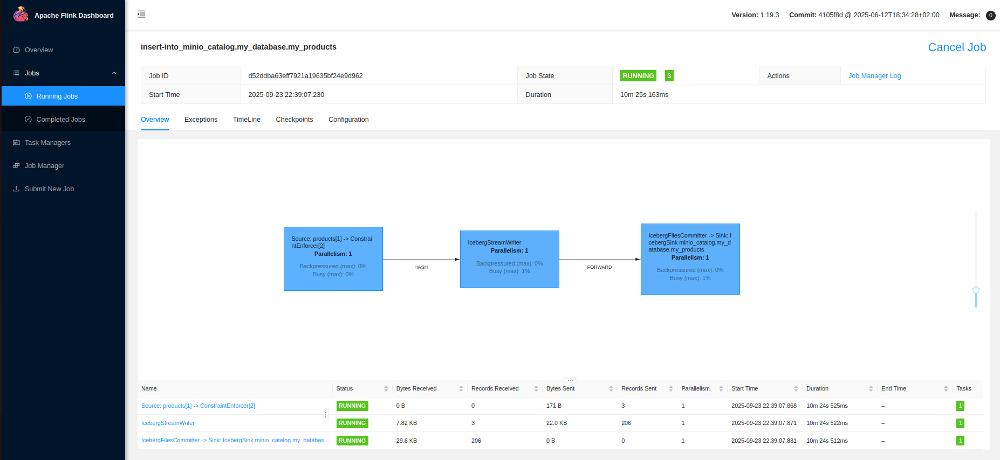
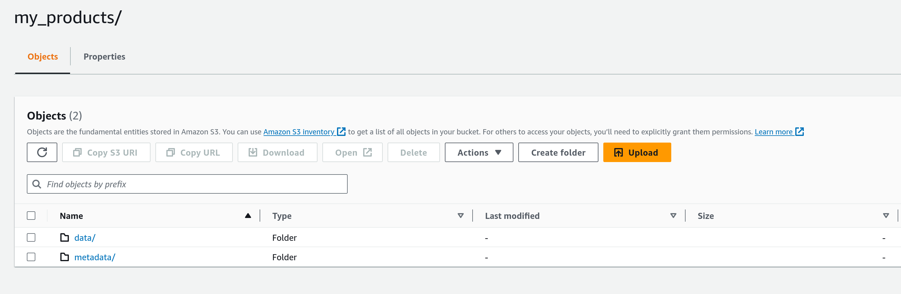

# Trying out Apache Iceberg with Apache Flink using Docker Compose

Use the docker-compose.yml file to create a MariaDB database and an Apache Flink Job and Task manager to work with.

Make sure to add your AWS credentials to the docker-compose.yml file first, so that it will be able to write to s3.

```
docker compose up -d
```

Once the containers are running, submit the job to Flink using:

```
docker exec -it jobmanager /opt/flink/bin/sql-client.sh embedded -f /opt/flink/job.sql
```

If you open your browser to `http://localhost:8081` you'll see the Flink UI with your job running, saving the data from the database to s3 using the Iceberg format



The data in s3 will be in a folder named after the database, in Parquet format.



You can use the AWS CLI to verfiy the data is there:

```
aws s3 ls s3://my-test-bucket/iceberg/my_database/my_products/data/
```

If you happen to use DuckDB, you can query the resulting parquet file on s3 to verify the data:

Assuming duckdb is installed, provide it with AWS details:

```
SET s3_region='us-east-1';
SET s3_access_key_id='AKAIXXXXXXXXXXXX';
SET s3_secret_access_key='XXXXXXXXXXXX';


SELECT * FROM 's3://my-test-bucket/iceberg/my_database/my_products/data/00000-0-b3a04103-6ef1-49fa-9c7b-62194183c3fd-00001.parquet';
```

You should see an output just like the following table

```
┌───────┬───────────┬───────────────┐
│  id   │   name    │     price     │
│ int32 │  varchar  │ decimal(10,2) │
├───────┼───────────┼───────────────┤
│     3 │ Product C │         39.99 │
│     2 │ Product B │         29.99 │
│     1 │ Product A │         19.99 │
└───────┴───────────┴───────────────┘
```