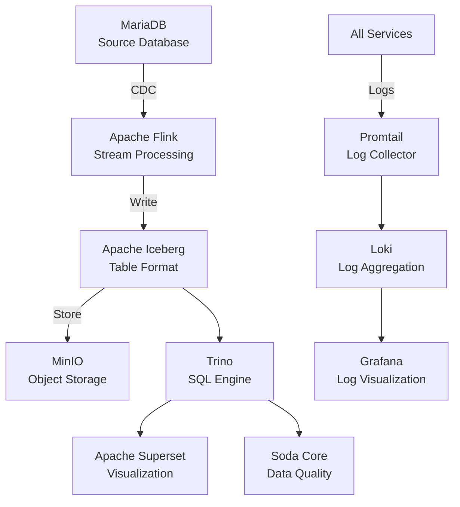

# 🚀 Modern Data Lakehouse Stack with Apache Flink, Iceberg, and Friends

A production-ready data lakehouse architecture demonstrating real-time CDC, data quality, SQL analytics, and visualization capabilities. This project showcases the integration of cutting-edge data technologies in a fully containerized environment.

## 🎯 What This Project Does

This stack implements a complete data lakehouse pipeline that:
- **Captures changes** from MariaDB in real-time using CDC (Change Data Capture)
- **Streams data** through Apache Flink for processing
- **Stores data** in Apache Iceberg tables on MinIO (S3-compatible storage)
- **Ensures quality** with automated Soda Core data quality checks
- **Enables analytics** via Trino SQL query engine
- **Visualizes insights** through Apache Superset dashboards
- **Centralizes logging** with Loki, Promtail, and Grafana

## 🏗️ Architecture



## 📦 Components

### Core Data Pipeline
- **Apache Flink 1.19.3**: Distributed stream processing framework
- **Apache Iceberg 1.6.1**: Modern table format for huge analytic datasets
- **MinIO**: High-performance S3-compatible object storage
- **MariaDB 10.6.14**: Source database with CDC enabled

### Analytics & Visualization
- **Trino 435**: Fast distributed SQL query engine for big data
- **Apache Superset 3.0.0**: Modern data exploration and visualization platform
- **Soda Core**: Automated data quality monitoring and testing

### Observability
- **Grafana 10.0.0**: Visualization and analytics platform
- **Loki 2.9.0**: Log aggregation system inspired by Prometheus
- **Promtail 2.9.0**: Agent for shipping logs to Loki

## 🚀 Quick Start

### Prerequisites
- Docker and Docker Compose
- Python 3.8+ (for Superset dashboard creation)
- 16GB RAM recommended
- 20GB free disk space

### 1. Start the Stack

```bash
# Clone the repository
git clone <your-repo-url>
cd apache_flink_and_iceberg

# Start all services with one command
./startup.sh
```

This will:
- Start all Docker containers
- Wait for services to initialize
- Submit the Flink CDC job automatically

### 2. Create Superset Dashboard

After services are running (about 1-2 minutes):

```bash
python3 superset/create_dashboard.py
```

## 🌐 Access Points

| Service | URL | Credentials | Purpose |
|---------|-----|-------------|---------|
| **Flink Web UI** | http://localhost:8081 | - | Monitor streaming jobs |
| **MinIO Console** | http://localhost:9001 | admin/password123 | Browse object storage |
| **Superset** | http://localhost:8088 | admin/admin | Data visualization |
| **Trino UI** | http://localhost:8082 | - | Query execution monitoring |
| **Grafana** | http://localhost:3000 | admin/admin | Log exploration |

## 🔍 Usage Examples

### Query Data with Trino

```bash
docker exec -it trino trino

# In Trino CLI:
SHOW CATALOGS;
USE iceberg.my_database;
SHOW TABLES;
SELECT * FROM my_products;
SELECT COUNT(*) as product_count, AVG(price) as avg_price FROM my_products;
```

### Check Data Quality

View automated data quality scan results:

```bash
docker logs soda
```

### Explore Logs in Grafana

1. Open http://localhost:3000 (admin/admin)
2. Navigate to Explore
3. Select Loki datasource
4. Example queries:
   - `{service="jobmanager"}` - Flink JobManager logs
   - `{container="superset"}` - Superset logs
   - `{service=~".*"} |= "ERROR"` - All errors across services

### Add Data to Source

Insert new products to see real-time CDC:

```bash
docker exec mariadb mysql -u root -prootpassword -e "
  USE mydatabase;
  INSERT INTO products (name, price) VALUES
    ('Product D', 49.99),
    ('Product E', 59.99);
"
```

Then query in Trino to see the new data reflected immediately.

## 📊 Data Flow Demonstration

1. **Source Data**: MariaDB contains a `products` table
2. **CDC Capture**: MySQL CDC connector captures all changes
3. **Stream Processing**: Flink processes the change stream
4. **Storage**: Data written to Iceberg tables in MinIO
5. **Analytics**: Trino provides SQL interface to Iceberg data
6. **Quality Checks**: Soda runs automated quality scans every 5 minutes
7. **Visualization**: Superset dashboards show real-time metrics
8. **Monitoring**: All service logs centralized in Grafana

## 🛠️ Advanced Configuration

### Customize Data Quality Checks

Edit `soda/checks.yml` to add custom quality rules:

```yaml
checks for my_products:
  - row_count > 10:
      name: Minimum products threshold
  - avg(price) < 1000:
      name: Price sanity check
```

### Scale Flink Workers

Modify `docker-compose.yml`:

```yaml
taskmanager:
  deploy:
    replicas: 4  # Increase for more parallelism
```

### Add Trino Catalogs

Create new catalog files in `trino/catalog/` to connect additional data sources.

## 📁 Project Structure

```
.
├── docker-compose.yml          # Service orchestration
├── Dockerfile                  # Custom Flink image
├── startup.sh                  # One-command startup script
├── Claude.md                   # Development progress tracking
├── jobs/
│   ├── job.sql                # Main CDC pipeline
│   └── test_complete.sql      # Verification queries
├── sql/
│   ├── init.sql              # MariaDB sample data
│   └── mariadb.cnf           # MariaDB configuration
├── soda/
│   ├── configuration.yml     # Soda data source config
│   └── checks.yml           # Data quality rules
├── trino/
│   └── catalog/             # Trino catalog configurations
├── superset/
│   ├── superset_config.py  # Superset configuration
│   ├── init_superset.sh    # Database initialization
│   └── create_dashboard.py # Dashboard automation
├── loki/
│   └── config.yml          # Loki configuration
├── promtail/
│   └── config.yml          # Log collection config
└── grafana/
    └── datasources/        # Grafana data sources
```

## 🔧 Troubleshooting

### Services Not Starting

```bash
# Check service status
docker compose ps

# View logs for specific service
docker compose logs [service-name]

# Restart a specific service
docker compose restart [service-name]
```

### Flink Job Issues

```bash
# Check job status
curl http://localhost:8081/jobs | jq .

# View Flink logs
docker logs jobmanager
```

### Data Not Appearing

```bash
# Verify MariaDB data
docker exec mariadb mysql -u root -prootpassword -e "SELECT * FROM mydatabase.products;"

# Check MinIO storage
docker exec minio mc ls -r local/iceberg/warehouse/
```

### Reset Everything

```bash
# Stop and remove all containers and volumes
docker compose down -v

# Start fresh
./startup.sh
```

## 🚦 Health Checks

### Verify All Services Running

```bash
# Check all containers are healthy
docker ps --format "table {{.Names}}\t{{.Status}}"
```

### Test End-to-End Pipeline

```bash
# Insert test data
docker exec mariadb mysql -u root -prootpassword -e "
  INSERT INTO mydatabase.products (name, price)
  VALUES ('Health Check Product', 99.99);
"

# Wait a few seconds, then verify in Iceberg
docker exec -it trino trino -e "
  SELECT * FROM iceberg.my_database.my_products
  WHERE name = 'Health Check Product';
"
```

## 📈 Performance Tuning

### Flink Optimization
- Increase checkpoint interval in `jobs/job.sql` for better throughput
- Adjust taskmanager memory in `docker-compose.yml`

### Trino Optimization
- Scale coordinator and workers separately
- Configure memory limits based on workload

### MinIO Optimization
- Use multiple drives for better I/O
- Enable erasure coding for redundancy

## 🤝 Contributing

Contributions are welcome! Areas for improvement:
- Additional data sources and sinks
- Custom Flink operators
- Enhanced Superset dashboards
- Kubernetes deployment manifests
- Terraform/Pulumi infrastructure as code
- Additional data quality checks
- Performance benchmarks

## 📚 Learn More

### Documentation
- [Apache Flink](https://flink.apache.org/)
- [Apache Iceberg](https://iceberg.apache.org/)
- [Trino](https://trino.io/)
- [Apache Superset](https://superset.apache.org/)
- [Soda Core](https://docs.soda.io/soda-core/)
- [Grafana Loki](https://grafana.com/oss/loki/)

### Related Topics
- Change Data Capture (CDC)
- Data Lakehouse Architecture
- Stream Processing
- ACID Transactions in Data Lakes
- Data Quality Engineering
- Observability in Data Platforms

## 📄 License

This project is open source and available under the MIT License.

## 🙏 Acknowledgments

Built with best-in-class open source technologies from:
- Apache Software Foundation
- Trino Software Foundation
- MinIO, Inc.
- Grafana Labs
- Soda Data

---

**Ready to explore modern data architecture?** Start with `./startup.sh` and watch your data flow! 🌊