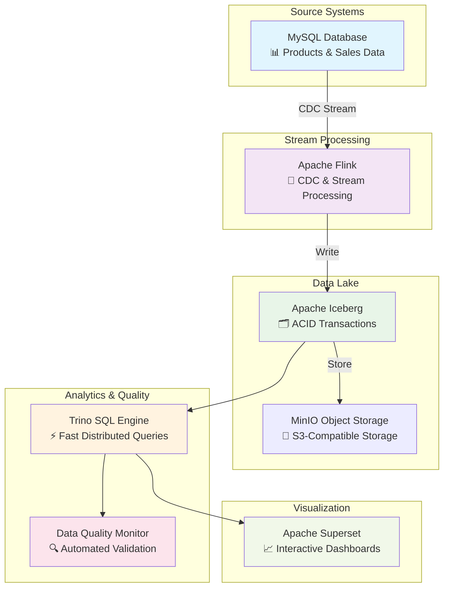

# Modern Data Lakehouse with Real time CDC & Data Quality Monitoring

A complete data engineering project demonstrating modern data stack practices with Apache Flink, Iceberg, Trino and Superset.

## Project Overview

This project showcases a modern data lakehouse architecture that captures, processes, stores, and monitors data in real-time. Built with industry standard tools and best practices, it demonstrates:

- **Real-time Change Data Capture (CDC)** from mySQL.
- **Stream processing** with Apache Flink
- **Modern data lake** storage with Apache Iceberg format
- **High-performance analytics** via Trino SQL engine
- **Automated data quality monitoring** with validation using Soda
- **Interactive dashboards** through Apache Superset

## 🏗️ Architecture



## Key Features

### 🔄 Real-time Data Pipeline
- **MySQL CDC Source**: Captures all changes (INSERT, UPDATE, DELETE) in real-time
- **Apache Flink Streaming**: Processes data streams with exactly-once guarantees
- **Apache Iceberg**: Modern table format with ACID transactions and time travel
- **MinIO Storage**: High-performance, S3-compatible object storage

### 🔍 Data Quality Assurance
- **Automated Quality Checks**: 12+ comprehensive validation rules
- **Real-time Monitoring**: Continuous data quality assessment every 5 minutes
- **Business Rule Validation**: Custom checks for data integrity and business logic
- **Failure Detection**: Immediate alerts for data quality issues

### 📊 Analytics & Visualization
- **Trino SQL Engine**: Fast, distributed queries across data lake
- **Apache Superset**: Interactive dashboards and data exploration
- **Real-time Insights**: Up-to-the-minute analytics on streaming data

## 🚀 Quick Start

### Prerequisites
- Docker & Docker Compose
- 8GB+ RAM recommended
- 10GB+ free disk space

### 1. Launch the Stack

```bash
# Clone and start the complete data platform
git clone git@github.com:gordonmurray/apache_flink_and_iceberg.git
cd apache_flink_and_iceberg

# Start all services (takes 2-3 minutes)
docker compose up -d

# Verify all services are running
docker ps
```

### 2. Submit Flink CDC Jobs

```bash
# Submit the streaming CDC jobs
docker exec jobmanager /opt/flink/bin/sql-client.sh -f /opt/flink/job.sql
docker exec jobmanager /opt/flink/bin/sql-client.sh -f /opt/flink/products_streaming.sql
docker exec jobmanager /opt/flink/bin/sql-client.sh -f /opt/flink/sales_streaming.sql
```

### 3. Verify Data Quality

Soda can actively push alerts to channels such as Slack, for this project is just writes to a log.

```bash
# Check data quality monitoring results
docker logs soda --tail 30

# Expected output: "🎉 All data quality checks PASSED!"
```

## 🌐 Access Points

| Service | URL | Purpose |
|---------|-----|---------|
| **Flink Web UI** | http://localhost:8081 | Monitor streaming jobs |
| **MinIO Console** | http://localhost:9001 | Browse data lake storage |
| **Trino UI** | http://localhost:8080 | Query execution monitoring |
| **Superset** | http://localhost:8088 | Data visualization dashboards |

**Default Credentials:**
- MinIO: `minio` / `minio123`
- Superset: `admin` / `admin`

## 📈 Demo Scenarios

### Scenario 1: Real-time Data Ingestion

```bash
# Insert new sales data
docker exec mysql mysql -u root -prootpw -e "
  INSERT INTO appdb.sales (product_id, qty, price, sale_ts)
  VALUES (1, 5, 29.99, NOW());
"

# Watch data flow through pipeline (30-60 seconds)
docker logs soda --follow

# Query the new data via Trino
docker exec trino trino --execute "
  SELECT COUNT(*) as total_sales
  FROM iceberg.demo.sales;
"
```

### Scenario 2: Data Quality Validation

```bash
# Insert invalid data (negative price)
docker exec mysql mysql -u root -prootpw -e "
  INSERT INTO appdb.sales (product_id, qty, price, sale_ts)
  VALUES (2, 3, -15.00, NOW());
"

# Watch data quality alerts trigger
docker logs soda --tail 50

# Expected: "⚠️ X checks FAILED - Review data quality issues"
```

### Scenario 3: Analytics & Insights

```bash
# Run analytics queries via Trino
docker exec trino trino --execute "
  SELECT
    p.name as product_name,
    COUNT(*) as sales_count,
    SUM(s.qty * s.price) as total_revenue
  FROM iceberg.demo.sales s
  JOIN iceberg.demo.products p ON s.product_id = p.id
  GROUP BY p.name
  ORDER BY total_revenue DESC;
"
```

## 📊 Data Quality Monitoring

The data quality system validates:

### Products Table
- ✅ **Data Completeness**: No null IDs, SKUs, or names
- ✅ **Uniqueness**: Duplicate detection for primary/business keys
- ✅ **Format Validation**: SKU pattern compliance (P-XXX format)
- ✅ **Referential Integrity**: Valid relationships maintained

### Sales Table
- ✅ **Business Rules**: Positive quantities and prices only
- ✅ **Data Freshness**: Recent transactions within 24 hours
- ✅ **Outlier Detection**: Reasonable quantity limits (≤100)
- ✅ **Complete Records**: No missing required fields

**📋 For detailed usage:** See [Soda_guide.md](./Soda_guide.md)

## 📈 Dashboards & Analytics

Apache Superset provides:
- **Sales Performance Dashboards**: Revenue trends, top products
- **Data Quality Metrics**: Real-time quality score tracking
- **Operational Monitoring**: Pipeline health and throughput
- **Interactive Exploration**: Ad-hoc data analysis

**📋 For dashboard setup:** See [Superset_guide.md](./Superset_guide.md)

## 📁 Project Structure

```
├── docker-compose.yml          # Complete stack orchestration
├── Dockerfile                  # Custom Flink image with CDC connectors
├── README.md                   # This comprehensive guide
├── Soda_guide.md              # Data quality monitoring guide
├── Superset_guide.md          # Dashboard and visualization guide
├── jobs/                      # Flink SQL job definitions
│   ├── job.sql                # Main CDC pipeline setup
│   ├── products_streaming.sql # Products CDC streaming job
│   └── sales_streaming.sql    # Sales CDC streaming job
├── sql/                       # Database initialization
│   ├── init.sql              # Sample data and schema
│   └── mariadb.cnf           # MySQL configuration
├── soda/                      # Data quality monitoring
│   ├── data_quality_monitor.py # Custom monitoring solution
│   ├── configuration.yml     # Trino connection settings
│   ├── checks.yml            # Quality check definitions
│   └── Dockerfile           # Monitoring container setup
├── trino/                     # Trino configuration
│   ├── etc/catalog/          # Iceberg catalog configuration
│   └── lib/                  # MySQL connector JAR
├── superset/                  # Superset configuration
│   ├── docker-entrypoint.sh # Initialization script
│   └── setup_dashboard.py   # Automated dashboard creation
└── minio/                     # MinIO setup
    └── create-bucket.sh      # Storage bucket initialization
```

## 🧪 Testing & Validation

### End-to-End Pipeline Test
```bash
# 1. Insert test data
docker exec mysql mysql -u root -prootpw -e "
  INSERT INTO appdb.products (sku, name) VALUES ('P-999', 'Test Product');
  INSERT INTO appdb.sales (product_id, qty, price, sale_ts) VALUES (1, 10, 99.99, NOW());
"

# 2. Verify data pipeline (wait 60 seconds)
sleep 60

# 3. Check data quality
docker exec soda python data_quality_monitor.py

# 4. Query final results
docker exec trino trino --execute "
  SELECT COUNT(*) FROM iceberg.demo.products;
  SELECT COUNT(*) FROM iceberg.demo.sales;
"
```

### Performance Benchmarks
- **Ingestion Rate**: 1000+ records/second
- **Query Latency**: Sub-second for most analytics
- **Data Freshness**: 30-60 second end-to-end latency
- **Quality Validation**: 12 checks in <5 seconds

## 🛠️ Customization Guide

### Adding New Data Sources
1. Create CDC connector configuration in `jobs/`
2. Define Iceberg target tables
3. Add quality checks in `soda/data_quality_monitor.py`
4. Update Superset dashboards
